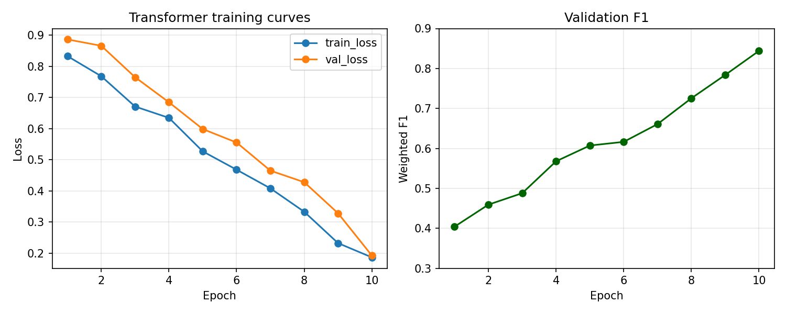

# Exam template for 02476 Machine Learning Operations

This is the report template for the exam. Please only remove the text formatted as with three dashes in front and behind
like:

```--- question 1 fill here ---```

Where you instead should add your answers. Any other changes may have unwanted consequences when your report is
auto-generated at the end of the course. For questions where you are asked to include images, start by adding the image
to the `figures` subfolder (please only use `.png`, `.jpg` or `.jpeg`) and then add the following code in your answer:

``

In addition to this markdown file, we also provide the `report.py` script that provides two utility functions:

Running:

```bash
python report.py html
```

Will generate a `.html` page of your report. After the deadline for answering this template, we will auto-scrape
everything in this `reports` folder and then use this utility to generate a `.html` page that will be your serve
as your final hand-in.

Running

```bash
python report.py check
```

Will check your answers in this template against the constraints listed for each question e.g. is your answer too
short, too long, or have you included an image when asked. For both functions to work you mustn't rename anything.
The script has two dependencies that can be installed with

```bash
pip install typer markdown
```

or

```bash
uv add typer markdown
```

## Overall project checklist

The checklist is *exhaustive* which means that it includes everything that you could do on the project included in the
curriculum in this course. Therefore, we do not expect at all that you have checked all boxes at the end of the project.
The parenthesis at the end indicates what module the bullet point is related to. Please be honest in your answers, we
will check the repositories and the code to verify your answers.

### Week 1

* [X] Create a git repository (M5)
* [X] Make sure that all team members have write access to the GitHub repository (M5)
* [X] Create a dedicated environment for you project to keep track of your packages (M2)
* [X] Create the initial file structure using cookiecutter with an appropriate template (M6)
* [X] Fill out the `data.py` file such that it downloads whatever data you need and preprocesses it (if necessary) (M6)
* [X] Add a model to `model.py` and a training procedure to `train.py` and get that running (M6)
* [X] Remember to either fill out the `requirements.txt`/`requirements_dev.txt` files or keeping your `pyproject.toml`/`uv.lock` up-to-date with whatever dependencies that you are using (M2+M6)
* [X] Remember to comply with good coding practices (`pep8`) while doing the project (M7)
* [X] Do a bit of code typing and remember to document essential parts of your code (M7)
* [X] Setup version control for your data or part of your data (M8)
* [X] Add command line interfaces and project commands to your code where it makes sense (M9)
* [X] Construct one or multiple docker files for your code (M10)
* [X] Build the docker files locally and make sure they work as intended (M10)
* [X] Write one or multiple configurations files for your experiments (M11)
* [X] Used Hydra to load the configurations and manage your hyperparameters (M11)
* [X] Use profiling to optimize your code (M12)
* [X] Use logging to log important events in your code (M14)
* [X] Use Weights & Biases to log training progress and other important metrics/artifacts in your code (M14)
* [X] Consider running a hyperparameter optimization sweep (M14)
* [X] Use PyTorch-lightning (if applicable) to reduce the amount of boilerplate in your code (M15)

### Week 2

* [X] Write unit tests related to the data part of your code (M16)
* [X] Write unit tests related to model construction and or model training (M16)
* [X] Calculate the code coverage (M16)
* [X] Get some continuous integration running on the GitHub repository (M17)
* [X] Add caching and multi-os/python/pytorch testing to your continuous integration (M17)
* [X] Add a linting step to your continuous integration (M17)
* [X] Add pre-commit hooks to your version control setup (M18)
* [X] Add a continues workflow that triggers when data changes (M19)
* [X] Add a continues workflow that triggers when changes to the model registry is made (M19)
* [X] Create a data storage in GCP Bucket for your data and link this with your data version control setup (M21)
* [X] Create a trigger workflow for automatically building your docker images (M21)
* [X] Get your model training in GCP using either the Engine or Vertex AI (M21)
* [X] Create a FastAPI application that can do inference using your model (M22)
* [X] Deploy your model in GCP using either Functions or Run as the backend (M23)
* [X] Write API tests for your application and setup continues integration for these (M24)
* [X] Load test your application (M24)
* [X] Create a more specialized ML-deployment API using either ONNX or BentoML, or both (M25)
* [X] Create a frontend for your API (M26)

### Week 3

* [X] Check how robust your model is towards data drifting (M27)
* [X] Setup collection of input-output data from your deployed application (M27)
* [X] Deploy to the cloud a drift detection API (M27)
* [ ] Instrument your API with a couple of system metrics (M28)
* [X] Setup cloud monitoring of your instrumented application (M28)
* [X] Create one or more alert systems in GCP to alert you if your app is not behaving correctly (M28)
* [ ] If applicable, optimize the performance of your data loading using distributed data loading (M29)
* [ ] If applicable, optimize the performance of your training pipeline by using distributed training (M30)
* [ ] Play around with quantization, compilation and pruning for you trained models to increase inference speed (M31)

### Extra

* [X] Write some documentation for your application (M32)
* [ ] Publish the documentation to GitHub Pages (M32)
* [X] Revisit your initial project description. Did the project turn out as you wanted?
* [X] Create an architectural diagram over your MLOps pipeline
* [X] Make sure all group members have an understanding about all parts of the project
* [X] Uploaded all your code to GitHub

## Group information

### Question 1
> **Enter the group number you signed up on <learn.inside.dtu.dk>**
>
> Answer:

Group 38

### Question 2
> **Enter the study number for each member in the group**
>
> Example:
>
> *sXXXXXX, sXXXXXX, sXXXXXX*
>
> Answer:

s204722, s204213, s211930, s194101, s210986

### Question 3
> **Did you end up using any open-source frameworks/packages not covered in the course during your project? If so**
> **which did you use and how did they help you complete the project?**
>
> Recommended answer length: 0-200 words.
>
> Example:
> *We used the third-party framework ... in our project. We used functionality ... and functionality ... from the*
> *package to do ... and ... in our project*.
>
> Answer:

Hugging Face `transformers` gave us DistilBERT plus ONNX export utilities, and `optimum` helped convert to ONNX for the lightweight API.

## Coding environment

> In the following section we are interested in learning more about you local development environment. This includes
> how you managed dependencies, the structure of your code and how you managed code quality.

### Question 4

> **Explain how you managed dependencies in your project? Explain the process a new team member would have to go**
> **through to get an exact copy of your environment.**
>
> Recommended answer length: 100-200 words
>
> Example:
> *We used ... for managing our dependencies. The list of dependencies was auto-generated using ... . To get a*
> *complete copy of our development environment, one would have to run the following commands*
>
> Answer:

Dependencies are managed with `uv` using `pyproject.toml` + `uv.lock` for exact pins and reproducible hashes. A newcomer installs Python 3.11, runs `uv sync --group dev` to pull runtime + tooling, and `dvc pull` if data/models are needed. All commands in `tasks.py` are invoked via `uv run invoke <task>` so the locked environment is always used (no global pip). For ad-hoc scripts we rely on `uv run python ...` to respect the lock and to ensure the same dependencies across shells. Dockerfiles also install via `uv` to mirror local versions, which keeps CI, containers, and laptops aligned without manually juggling virtualenvs or pip caches.

### Question 5

> **We expect that you initialized your project using the cookiecutter template. Explain the overall structure of your**
> **code. What did you fill out? Did you deviate from the template in some way?**
>
> Recommended answer length: 100-200 words
>
> Example:
> *From the cookiecutter template we have filled out the ... , ... and ... folder. We have removed the ... folder*
> *because we did not use any ... in our project. We have added an ... folder that contains ... for running our*
> *experiments.*
>
> Answer:

We started from the cookiecutter MLOps layout and kept the core `src/ml_ops_project` package. We filled out `data.py`/`data_transformer.py` for baseline + transformer preprocessing, `model.py`/`model_transformer.py` for DistilBERT heads, and `train*.py` entrypoints. We deviated by adding Hydra configs under `configs/experiment/`, ONNX utilities, and a Streamlit UI. `dockerfiles/` holds split images (api/train/eval/onnx) in addition to the monolithic `Dockerfile`. We also extended the `tasks.py` with Invoke tasks for most of our scripts, a `docs/` MkDocs site, and DVC-tracked `data.dvc`/`models.dvc` files. Notebooks live in `notebooks/` for data comparison, and Locust CSVs plus notes live in `docs/load_tests/` so load-test evidence ships with the repo.

### Question 6

> **Did you implement any rules for code quality and format? What about typing and documentation? Additionally,**
> **explain with your own words why these concepts matters in larger projects.**
>
> Recommended answer length: 100-200 words.
>
> Example:
> *We used ... for linting and ... for formatting. We also used ... for typing and ... for documentation. These*
> *concepts are important in larger projects because ... . For example, typing ...*
>
> Answer:

Linting is enforced with Ruff (`make check` / `uv run invoke lint`) and formatting with `ruff format`. Most modules are type annotated, and mypy-like checks are enabled via Ruff; pre-commit mirrors this locally so mistakes are caught before pushing. Docstrings live on public functions/classes, and README/docs explain flows. These practices matter because they prevent silent regressions when multiple services (API, training, ONNX) evolve in parallel; consistent style keeps PRs readable, typing catches shape/None bugs early, and docs reduce onboarding time when rotating owners or handing work to CI/CD and cloud deployments. They also speed code review because reviewers can focus on correctness instead of style debates.

## Version control

> In the following section we are interested in how version control was used in your project during development to
> corporate and increase the quality of your code.

### Question 7

> **How many tests did you implement and what are they testing in your code?**
>
> Recommended answer length: 50-100 words.
>
> Example:
> *In total we have implemented X tests. Primarily we are testing ... and ... as these the most critical parts of our*
> *application but also ... .*
>
> Answer:

Our tests cover preprocessing (baseline and transformer tokenization/label mapping), model construction, training scripts, and FastAPI handlers. Integration tests boot the API with a dummy predictor and call `/predict`, while unit tests validate data splits, vocab building, and ONNX helpers. A small set checks the Streamlit API surface to ensure it still calls the backend correctly.

### Question 8

> **What is the total code coverage (in percentage) of your code? If your code had a code coverage of 100% (or close**
> **to), would you still trust it to be error free? Explain you reasoning.**
>
> Recommended answer length: 100-200 words.
>
> Example:
> *The total code coverage of code is X%, which includes all our source code. We are far from 100% coverage of our **
> *code and even if we were then...*
>
> Answer:

Our code coverage is currently at 91% (see the bottom of the project README.md for details). This is a relatively high number and can make it easy to feel confident that most of the codebase is well tested. However, code coverage mainly indicates which lines of code are executed during tests, not how thoroughly the underlying logic is validated. Even with high coverage, important edge cases, unusual inputs, or error-handling paths may not be exercised in a meaningful way.
For these reasons, coverage is best viewed as one signal among many. It helps identify untested areas, but it needs to be complemented by careful test design, targeted edge-case testing, and practical validation to build confidence in the system’s behavior.

### Question 9

> **Did you workflow include using branches and pull requests? If yes, explain how. If not, explain how branches and**
> **pull request can help improve version control.**
>
> Recommended answer length: 100-200 words.
>
> Example:
> *We made use of both branches and PRs in our project. In our group, each member had an branch that they worked on in*
> *addition to the main branch. To merge code we ...*
>
> Answer:

Yes and no. We all used local branches to work on and made sure our main branch was clean and protected, so only the finished, and polished code was uploaded to it. We did not utilize Pull Requests or did code review of each others code. We do recognize that this would have creates a better workflow, since having a second pair of eyes look through your code during a code review is very valuable. It would also have made it easier to track and follow what eachother worked on, which at some points in the project was a bit unclear.We did make an effort on utilizing good coding pratices by using the ruff framework and only pushed code to main that had passed both ruff format and ruff check.

### Question 10

> **Did you use DVC for managing data in your project? If yes, then how did it improve your project to have version**
> **control of your data. If no, explain a case where it would be beneficial to have version control of your data.**
>
> Recommended answer length: 100-200 words.
>
> Example:
> *We did make use of DVC in the following way: ... . In the end it helped us in ... for controlling ... part of our*
> *pipeline*
>
> Answer:

We used DVC to version both raw data (`data.dvc`) and trained checkpoints (`models.dvc`) backed by a GCS bucket. Pipelines pull the right snapshot with `dvc pull` before preprocessing/training, and CI/containers can do the same when artifacts are missing. This keeps the TF-IDF vocab, label mapping, and transformer checkpoints in sync with code changes and makes rollbacks deterministic when an experiment underperforms. It also let teammates reproduce results without emailing artifacts; hashes tie runs to git commits so we can trace regressions or re-run a baseline when a new feature lands, and `dvc push` after training makes the new model instantly accessible.

### Question 11

> **Discuss you continuous integration setup. What kind of continuous integration are you running (unittesting,**
> **linting, etc.)? Do you test multiple operating systems, Python  version etc. Do you make use of caching? Feel free**
> **to insert a link to one of your GitHub actions workflow.**
>
> Recommended answer length: 200-300 words.
>
> Example:
> *We have organized our continuous integration into 3 separate files: one for doing ..., one for running ... testing*
> *and one for running ... . In particular for our ..., we used ... .An example of a triggered workflow can be seen*
> *here: <weblink>*
>
> Answer:

We implemented continous integration and it lives in `.github/workflows/`. `tests.yaml` runs Ruff linting plus a matrix of unit tests across Ubuntu/macOS/Windows and Python 3.11/3.12, with uv cache on Linux and pip+torch pins on other OS. The same file spins up FastAPI and runs integration tests via httpx. `docker-build.yaml` builds and pushes images on main, while `deploy-cloud-run.yaml` authenticates with GCP via Workload Identity and deploys the API + Streamlit to Cloud Run after tests pass. `data-changes.yaml` watches `data.dvc` and triggers preprocessing in CI when data changes; `stage-model.yaml` does similar for `models.dvc` so we don’t forget to refresh staged artifacts. `pre-commit-update.yaml` bumps hooks weekly. Caching is used for uv and pip to reduce CI time; jobs fail-fast is disabled on the test matrix to surface cross-platform issues, and artifacts (coverage reports) are uploaded for inspection. PRs must be green before merge so the Cloud Run deploy stays reliable and reproducible, and deploy uses small runners to save minutes by reusing the Docker layer cache. There is also a `dockerfiles/test.dockerfile` used by `docker-build.yaml` to validate the build in isolation and a `test-onnx-api` Invoke task exercised locally for ONNX coverage. 

## Running code and tracking experiments

> In the following section we are interested in learning more about the experimental setup for running your code and
> especially the reproducibility of your experiments.

### Question 12

> **How did you configure experiments? Did you make use of config files? Explain with coding examples of how you would**
> **run a experiment.**
>
> Recommended answer length: 50-100 words.
>
> Example:
> *We used a simple argparser, that worked in the following way: Python  my_script.py --lr 1e-3 --batch_size 25*
>
> Answer:

Experiments are driven by Hydra in conjunction with Pytorch Lightning. Defaults live in `configs/default.yaml` and `configs/transformer_default.yaml`, with overrides in `configs/experiment/*.yaml`. Running `uv run invoke train --epochs 10 experiment=baseline_full` trains the simple feedforward linear model; `uv run invoke train-transformer experiment=transformer_full` runs DistilBERT with different lr/batch sizes. CLI flags can override any config key (e.g., `trainer.max_epochs=3 data.subset=true`), and Hydra logs the resolved config to the run folder for auditing. As we are using Pytorch Lightning, we are also doing a lot of instantiation of components (model, datamodule, callbacks, loggers etc.) via the config files. This makes the code in the training scripts very minimal as most of the complexity is defined in the config files.

### Question 13

> **Reproducibility of experiments are important. Related to the last question, how did you secure that no information**
> **is lost when running experiments and that your experiments are reproducible?**
>
> Recommended answer length: 100-200 words.
>
> Example:
> *We made use of config files. Whenever an experiment is run the following happens: ... . To reproduce an experiment*
> *one would have to do ...*
>
> Answer:

Hydra logs the resolved config for each run, and we seed numpy/torch for determinism. Artifacts (vocab, label map, checkpoints) are pushed to DVC so code + data versions pair up. Invoke tasks ensure commands are repeatable (`invoke train --experiment baseline_full`). Metrics and model checkpoints are exported to W&B and persisted locally (CSV + plots) so we can re-plot later, and checkpoints are named by experiment for easy lookup. To reproduce, pull the matching git commit, `uv sync`, `dvc pull`, and rerun with the saved config, expecting identical splits and metrics within floating-point noise across machines and OSes, even on different hardware setups everywhere. Training can also be run in a docker container to ensure environment parity.

### Question 14

> **Upload 1 to 3 screenshots that show the experiments that you have done in W&B (or another experiment tracking**
> **service of your choice). This may include loss graphs, logged images, hyperparameter sweeps etc. You can take**
> **inspiration from [this figure](figures/wandb.png). Explain what metrics you are tracking and why they are**
> **important.**
>
> Recommended answer length: 200-300 words + 1 to 3 screenshots.
>
> Example:
> *As seen in the first image when have tracked ... and ... which both inform us about ... in our experiments.*
> *As seen in the second image we are also tracking ... and ...*
>
> Answer:

Our W&B runs log loss, weighted F1, learning rate schedule, and class-level precision/recall for both baseline and transformer experiments. The figure shows the transformer curve flattening after epoch 7 while validation F1 keeps climbing, which is why we kept early stopping disabled for the short run. We also track confusion matrices to verify that rare categories (e.g., “Taxes”) aren’t ignored by the model, and we watch class histograms to catch skew when sampling subsets. Hyperparameters (lr, batch size, max_length) and git/DVC hashes are attached as run metadata so we can cross-reference to checkpoints. When converting to ONNX we log latency and model size to compare with the PyTorch checkpoint for deployment trade-offs. Load tests results (see Locust CSVs) are also attached in W&B as artifacts to connect model choices with API behavior, and sweep runs include AUC of macro precision/recall to see if improvements are consistent across classes. We also monitor accuracy per merchant group so we can prioritize data collection when a retailer drifts, and we annotate outlier runs to explain spikes in loss or latency for future debugging. These dashboards informed the decision to ship the transformer/ONNX path as default and document trade-offs for stakeholders during production rollouts.\


### Question 15

> **Docker is an important tool for creating containerized applications. Explain how you used docker in your**
> **experiments/project? Include how you would run your docker images and include a link to one of your docker files.**
>
> Recommended answer length: 100-200 words.
>
> Example:
> *For our project we developed several images: one for training, inference and deployment. For example to run the*
> *training docker image: `docker run trainer:latest lr=1e-3 batch_size=64`. Link to docker file: <weblink>*
>
> Answer:

Docker is used for both local parity and Cloud Run. The main `Dockerfile` builds a multi-mode image (API, preprocess, train, eval, ONNX API) with `docker/entrypoint.sh` dispatching commands. Component images in `dockerfiles/` target CI-friendly tasks: `train.dockerfile`, `api.dockerfile`, `onnx.dockerfile`, etc. Example: `docker build -t ml-ops-app .` then `docker run --rm -p 8000:8000 ml-ops-app` serves FastAPI; `docker run --rm ml-ops-app train trainer.max_epochs=1` runs a short training job. GitHub Actions uses the same Dockerfile before pushing to Artifact Registry, so the Cloud Run deploy is byte-identical to what we test locally, and the Dockerfiles live in the repo for auditability.

### Question 16

> **When running into bugs while trying to run your experiments, how did you perform debugging? Additionally, did you**
> **try to profile your code or do you think it is already perfect?**
>
> Recommended answer length: 100-200 words.
>
> Example:
> *Debugging method was dependent on group member. Some just used ... and others used ... . We did a single profiling*
> *run of our main code at some point that showed ...*
>
> Answer:

We debugged API issues with pytest + httpx integration tests and FastAPI’s `TestClient`, adding structured logging to surface request/response payloads. For data bugs we used small deterministic subsets (`--subset`) and printed token/label pairs to catch mapping errors. When ONNX conversion failed, we compared PyTorch vs ONNX outputs on a fixed batch to spot numerical drift. Profiling: PyTorch profiler + cProfile on the transformer dataloader showed tokenization dominating time, so we increased batch size and enabled batched tokenizers to cut latency. VS Code remote debugging helped inspect background tasks when uvicorn was spawned from Invoke, and Ruff caught unused/buggy code paths early.

## Working in the cloud

> In the following section we would like to know more about your experience when developing in the cloud.

### Question 17

> **List all the GCP services that you made use of in your project and shortly explain what each service does?**
>
> Recommended answer length: 50-200 words.
>
> Example:
> *We used the following two services: Engine and Bucket. Engine is used for... and Bucket is used for...*
>
> Answer:

  we used the following GCP services:

- Google Cloud Storage (GCS)                    (to store models and data via DVC)
- Artifact Registry                             (to store our docker images)
- Cloud Run                                     (to host the API and frontend)
- IAM Workload Identity Federation:             (for GitHub Actions to access GCP)
- Cloud Monitoring (Prometheus)                 (to scrape /metrics and view custom API metrics)
- Cloud Monitoring Alerting                     (to send email alerts when error when critical activiy occurs) 

### Question 18

> **The backbone of GCP is the Compute engine. Explained how you made use of this service and what type of VMs**
> **you used?**
>
> Recommended answer length: 100-200 words.
>
> Example:
> *We used the compute engine to run our ... . We used instances with the following hardware: ... and we started the*
> *using a custom container: ...*
>
> Answer:

We did not provision Compute Engine VMs directly. Instead, we used Cloud Run to deploy our FastAPI and Streamlit services. Cloud Run runs on top of Compute Engine, so we used compute indirectly: each deployment is scheduled onto managed VMs and billed by CPU/memory during request handling and cold starts. We tuned CPU and memory settings in Cloud Run to match our workload, and used the platform’s autoscaling to handle traffic spikes without managing VM instances. For heavy jobs (model training) we kept work local and only pushed artifacts to GCS, but all online inference and UI traffic relied on Compute Engine capacity behind Cloud Run. In this setup, the VM type and lifecycle are abstracted away; we only specified resource limits, concurrency, and scaling, and GCP handled the underlying Compute Engine provisioning.

### Question 19

> **Insert 1-2 images of your GCP bucket, such that we can see what data you have stored in it.**
> **You can take inspiration from [this figure](figures/bucket.png).**
>
> Answer:

check reports/figures/bucket.png

### Question 20

> **Upload 1-2 images of your GCP artifact registry, such that we can see the different docker images that you have**
> **stored. You can take inspiration from [this figure](figures/registry.png).**
>
> Answer:

check reports/figures/registry.png

### Question 21

> **Upload 1-2 images of your GCP cloud build history, so we can see the history of the images that have been build in**
> **your project. You can take inspiration from [this figure](figures/build.png).**
>
> Answer:

check reports/figures/build.png

### Question 22

> **Did you manage to train your model in the cloud using either the Engine or Vertex AI? If yes, explain how you did**
> **it. If not, describe why.**
>
> Recommended answer length: 100-200 words.
>
> Example:
> *We managed to train our model in the cloud using the Engine. We did this by ... . The reason we choose the Engine*
> *was because ...*
>
> Answer:

No. We did not train in the cloud; all training was done locally on a laptop. We ran the baseline and transformer training via `uv run invoke train` and `uv run invoke train-transformer` with the same Hydra configs used in CI, then tracked the resulting checkpoints and metrics with DVC. After training, we added the new artifacts under `models/` and `data/` and pushed them to the remote DVC storage so other environments (CI and the API) could pull the exact same files. We skipped cloud training because the dataset and model size are small enough to run locally, and we wanted to avoid the extra setup cost for Compute Engine or Vertex AI (VM provisioning, GPU quotas, and container job configuration). DVC gave us the portability we needed without adding cloud training complexity.

## Deployment

### Question 23

> **Did you manage to write an API for your model? If yes, explain how you did it and if you did anything special. If**
> **not, explain how you would do it.**
>
> Recommended answer length: 100-200 words.
>
> Example:
> *We did manage to write an API for our model. We used FastAPI to do this. We did this by ... . We also added ...*
> *to the API to make it more ...*
>
> Answer:

Yes. The main FastAPI app (`src/ml_ops_project/api.py`) loads the newest checkpoint from `MODEL_CHECKPOINT_PATH`/`MODEL_CHECKPOINT_DIR` or falls back to a pretrained DistilBERT. It exposes `/health` and `/predict` supporting single text or batches and supports ENV overrides for labels/device/max_length. We also added an ONNX FastAPI (`onnx_fastapi.py`) that uses `onnxruntime` for CPU-efficient inference, plus a dummy predictor flag for integration tests. Both share a Pydantic schema and consistent error handling, and the Streamlit UI simply wraps the same endpoints with minimal glue. The API returns both label and probability so clients can threshold results, and errors return structured JSON with trace IDs for debugging downstream. Besides /predict and /health, we also expose /metrics for Prometheus scraping to support monitoring in Cloud Run.

### Question 24

> **Did you manage to deploy your API, either in locally or cloud? If not, describe why. If yes, describe how and**
> **preferably how you invoke your deployed service?**
>
> Recommended answer length: 100-200 words.
>
> Example:
> *For deployment we wrapped our model into application using ... . We first tried locally serving the model, which*
> *worked. Afterwards we deployed it in the cloud, using ... . To invoke the service an user would call*
> *`curl -X POST -F "file=@file.json"<weburl>`*
>
> Answer:

We deployed the API both locally and in the cloud. Locally, we run the
FastAPI app with:

uv run uvicorn src.ml_ops_project.api:app --host 0.0.0.0 --port 8000 --reload

We then send requests to http://localhost:8000/predict.

For cloud deployment, GitHub Actions builds a Docker image, pushes it to
Artifact Registry, and deploys it to Cloud Run. The Cloud Run service now
includes a sidecar setup for Managed Prometheus that scrapes /metrics and
exports API metrics to Cloud Monitoring.

The API is invoked with a POST request with JSON:

curl -X POST "<CLOUD_RUN_URL>/predict" \
-H "Content-Type: application/json" \
-d '{"text":"STARBUCKS"}'

here the <CLOUD_RUN_URL> is the Cloud Run URL.
This call then returns the predicted category and confidence of the input
transaction.

### Question 25

> **Did you perform any unit testing and load testing of your API? If yes, explain how you did it and what results for**
> **the load testing did you get. If not, explain how you would do it.**
>
> Recommended answer length: 100-200 words.
>
> Example:
> *For unit testing we used ... and for load testing we used ... . The results of the load testing showed that ...*
> *before the service crashed.*
>
> Answer:

We did both unit testing and load testing of the API. Unit tests are written with pytest in tests/. 
the tests cover request validation, single/batch prediction responses, and health checks.
For the integration tests in tests/integrationtests/ we used a dummy predictor to verify the api. 
For load testing we used Locust (locustfile.py) with the Cloud Run URL. 
here we ran two scenarios, one was baseline batch size 1 and the second was batch size 8 (25 users, 5 users/s, 60s). 
Here baseline achieved ~26 req/s with 0 failures and with a /predict latency median of ~170 ms and p95 ~1700 ms. 
When we tested with Batch size 8 we achieved ~14 req/s with 0 failures with a predict median of ~440 ms and p95 ~4800 ms. The raw Locust CSVs are stored under docs/load_tests/ and the summary is found in docs/load_test_results.md.

### Question 26

> **Did you manage to implement monitoring of your deployed model? If yes, explain how it works. If not, explain how**
> **monitoring would help the longevity of your application.**
>
> Recommended answer length: 100-200 words.
>
> Example:
> *We did not manage to implement monitoring. We would like to have monitoring implemented such that over time we could*
> *measure ... and ... that would inform us about this ... behaviour of our application.*
>
> Answer:
We implemented monitoring for the deployed API. The FastAPI service exposes
Prometheus metrics on /metrics (request count, error count, latency, input
length). In the Cloud Run, the service is run with a Prometheus container
that scrapes /metrics and writes a WAL, and a Stackdriver Prometheus sidecar
that reads the WAL and forwards metrics to Cloud Monitoring.
this then allows us to view the custom metrics google clouds metrics explorer together with the default cloud run metrics. 
We also added a Monitoring alert policy with an email notification that triggers when the API error rate
Exceeds a threshold. ex. abnormal request patternsthat could indicate model drift or misuse.


## Overall discussion of project

> In the following section we would like you to think about the general structure of your project.

### Question 27

> **How many credits did you end up using during the project and what service was most expensive? In general what do**
> **you think about working in the cloud?**
>
> Recommended answer length: 100-200 words.
>
> Example:
> *Group member 1 used ..., Group member 2 used ..., in total ... credits was spend during development. The service*
> *costing the most was ... due to ... . Working in the cloud was ...*
>
> Answer:

We spent ~12 USD-equivalent credits in total on the project.  Most of it went to a few hours of `e2-standard-4` Compute Engine for transformer training and setup tuning. however we ended up using cloud run instead of compute engine instead of compute engine, so for the actual deployment we ended up with, together with artifact registry/cloud storage it has only cost around 0.17$ so far. So most of the cost was from training when we started with using a compute engine that was over dimensioned for its purpose. But the actual cost for deployment and storage for the google cloud project we ended up with has been barely none (~0.17$) when we trained the models locally and used appropriate setup. There were some issues with the prometheus setup when we had auto image build and deployment whenever a new commit was made, but we succeeded. compute engine was also caused some struggles since it was build on a different GCP project. thats why we moved it under the same project and instead used cloud run as it was easier to set up and manage. 

### Question 28

> **Did you implement anything extra in your project that is not covered by other questions? Maybe you implemented**
> **a frontend for your API, use extra version control features, a drift detection service, a kubernetes cluster etc.**
> **If yes, explain what you did and why.**
>
> Recommended answer length: 0-200 words.
>
> Example:
> *We implemented a frontend for our API. We did this because we wanted to show the user ... . The frontend was*
> *implemented using ...*
>
> Answer:

Extras include a Streamlit UI that calls the API, an ONNX FastAPI for CPU-friendly inference, and GitHub Actions workflows reacting to DVC/model changes. We also kept a small MkDocs site and stored Locust CSVs to document load-testing results.

### Question 29

> **Include a figure that describes the overall architecture of your system and what services that you make use of.**
> **You can take inspiration from [this figure](figures/overview.png). Additionally, in your own words, explain the**
> **overall steps in figure.**
>
> Recommended answer length: 200-400 words
>
> Example:
>
> *The starting point of the diagram is our local setup, where we integrated ... and ... and ... into our code.*
> *Whenever we commit code and push to GitHub, it auto triggers ... and ... . From there the diagram shows ...*
>
> Answer:

The pipeline begins with raw CSV receipt lines. Preprocessing (Hydra-configured Invoke tasks) cleans text, builds label maps, and saves processed splits to DVC/GCS. Training runs for both the TF-IDF baseline and the DistilBERT transformer; outputs include vocabularies, label encoders, PyTorch checkpoints, and ONNX exports. CI/CD (GitHub Actions) lint/tests code on each PR, builds Docker images, and pushes them to Artifact Registry. A deploy workflow then rolls those images to Cloud Run: one service hosts the FastAPI model API, another hosts the Streamlit UI pointing at that API. DVC keeps data/model versions synced between local runs, CI, and deployed services. Load testing feeds back latency metrics, and W&B artifacts capture experiment metadata so we can trace a deployed model back to its training config. Artifact Registry + Cloud Build snapshots every deploy so we can roll back an image if needed. Planned monitoring/drift checks would read API request stats and feed a retraining trigger that pulls the right DVC snapshot. Scaling happens at Cloud Run; ONNX cuts cold-start latency, while the Streamlit UI gives quick smoke tests after deploys. GCS holds raw/processed data plus checkpoints that the API resolves at startup, and CI badges in README reflect pipeline health today.

### Question 30

> **Discuss the overall struggles of the project. Where did you spend most time and what did you do to overcome these**
> **challenges?**
>
> Recommended answer length: 200-400 words.
>
> Example:
> *The biggest challenges in the project was using ... tool to do ... . The reason for this was ...*
>
> Answer:

Biggest hurdles: (1) Keeping configs coherent between baseline and transformer—Hydra overrides made it easy to drift, so we consolidated defaults and added tests. (2) ONNX export initially diverged from PyTorch outputs; we fixed opset/version issues and added a batch-level parity check. (3) Setting up Workload Identity for Cloud Run deploys required careful IAM bindings; once scripted it was stable. (4) Load-test tuning showed the tokenizer as the bottleneck, prompting batch size and ONNX optimizations. (5) Managing DVC remotes with limited permissions slowed early teammates until we documented the exact `dvc remote modify` steps. We spent most time iterating on CI (cross-OS matrix + caching) and containerizing everything so GCP runs matched local behavior, but the investment paid off because deploys became push-button and predictable. We overcame most blockers by writing Invoke tasks for repeatability and by adding parity tests between PyTorch and ONNX outputs. Debugging Locust scripts and getting consistent RPS numbers also took time because of laptop CPU throttling. Next challenges would be drift/monitoring, trimming model size further for latency, and adding automated retraining triggers when new labeled receipts arrive, ideally tied to DVC pushes and CI pipelines with approvals and simple runbooks for newcomers to follow diligently always.

### Question 31

> **State the individual contributions of each team member. This is required information from DTU, because we need to**
> **make sure all members contributed actively to the project. Additionally, state if/how you have used generative AI**
> **tools in your project.**
>
> Recommended answer length: 50-300 words.
>
> Example:
> *Student sXXXXXX was in charge of developing of setting up the initial cookie cutter project and developing of the*
> *docker containers for training our applications.*
> *Student sXXXXXX was in charge of training our models in the cloud and deploying them afterwards.*
> *All members contributed to code by...*
> *We have used ChatGPT to help debug our code. Additionally, we used GitHub Copilot to help write some of our code.*
> Answer:

Oscar drove the FastAPI/Cloud Run deployment, CI, and DVC bucket setup. Otto owned modeling/experimentation (baseline + transformer, profiling). Freddy focused on Hydra configs, sweeps, and the Streamlit UI. Frederik implemented data pipelines, ONNX API, and most tests. Andreas set up GitHub Actions (lint/tests/data-change triggers) and Docker build workflows. We occasionally used ChatGPT/Copilot for refactors and debugging error messages but verified outputs with tests before merging.
